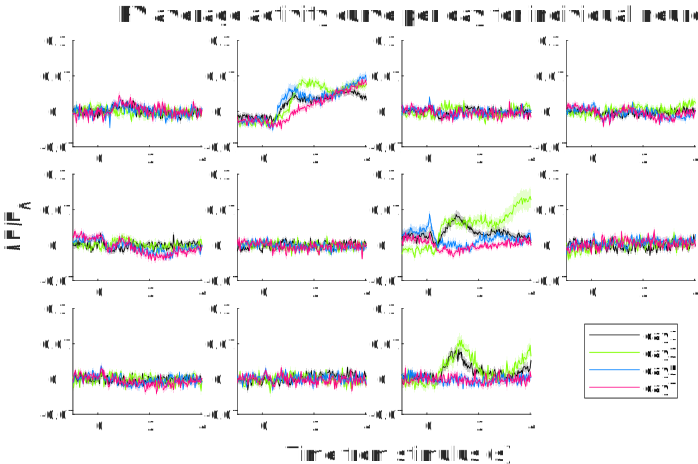
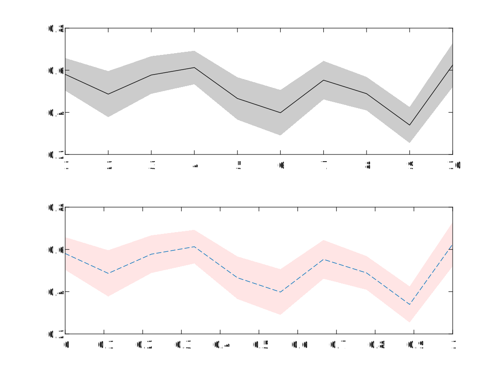

埃博拉酱的MATLAB作图工具包，包含一系列实用的作图工具。依赖[埃博拉酱的Windows工具](https://github.com/Silver-Fang/EbolaChansWindowsTools)和[埃博拉酱的函数助手](https://github.com/Silver-Fang/EbolaChansFunctionHelpers)

本项目的发布版本号遵循[语义化版本](https://semver.org/lang/zh-CN/)规范。开发者认为这是一个优秀的规范，并向每一位开发者推荐遵守此规范。
# 目录
- [ColorAllocate](#ColorAllocate) 为白色背景下的作图分配合适的颜色
- [FigureAspectRatio](#FigureAspectRatio) 设置当前图窗的纵横比
- [LegendMultiShadowedLines](#LegendMultiShadowedLines) 带图例的多条误差阴影线图
- [ShadowedLine](#ShadowedLine) 将平均值±误差曲线，通过中间一条均线、两边误差边界阴影的形式作图出来。
- [StripBackground](#StripBackground) 将指定图像文件中指定的颜色视为背景，去除之
# ColorAllocate
为白色背景下的作图分配合适的颜色

作图时不知道使用什么颜色最显眼、最有区分度？本函数生成白色背景下的最优化配色方案。如果背景是黑色，用255减去分配出的颜色即可。

本函数会自动保存以前的计算结果，可以重复利用加快计算。
```MATLAB
Data=rand(9,9);
tic;
Colors=ColorAllocate(9)
toc
figure;
hold on;
for a=1:9
	plot(Data(a,:),"Color",Colors(a,:));
end
%再次调用速度加快，因为保存了之前的结果
tic;
Colors=ColorAllocate(9)
toc
```
## 输入参数
NoColors(1,1)uint8，必需参数，要分配的颜色个数

TryCount(1,1)uint8，可选位置参数，尝试优化的次数。一般来说次数越多优化效果越好，但更消耗时间。默认如果找到了保存的计算结果就不再尝试优化，否则优化1次。
## 返回值
Colors(:,3)，每一行代表一个颜色的RGB值
# FigureAspectRatio
设置当前图窗的纵横比

在MATLAB之外对图窗进行不维持纵横比的拉伸，往往会导致字符也被扭曲。为了避免这种情况，建议在导出之前在MATLAB内部设置好图窗的纵横比。
```MATLAB
%假设当前图窗的尺寸为：宽度×高度=400×300
FigureAspectRatio(3,2);
%图窗面积仍为120000，但尺寸变为424×283，即3:2
FigureAspectRatio(2,1,"Amplify");
%相对于2:1的比例要求来说，283的高度是较大的，424的宽度是较小的，因此拉宽到566×283
FigureAspectRatio(1,1,"Narrow");
%相对于1:1的比例要求来说，283的高度是较小的，566的宽度是较大的，因此压扁到283×283
FigureAspectRatio(1,2,2);
%当前面积283×283=80089，放大2²=4倍变成320356，分配宽度1、高度2的比例，则得到400×800
```
## 必需参数
HorizontalProportion(1,1)，宽度比值。例如如果你希望图窗为4:3，则此值给4

VerticalProportion(1,1)，高度比值。例如如果你希望图窗为4:3，则此值给3
## 可选参数
Scale=1，缩放倍率或模式。
- 若为1，表示缩放后的图跟原图面积相等
- 若为某值k，则缩放后的面积变成缩放前的k²倍
- 若为"Amplify"，则保持当前比值相对较大的一边长度不变，仅拉长另一边到给定比值
- 若为"Narrow"，则保持当前比值较小的一边长度不变，仅压缩另一边到给定比值
## 名称-值对组参数
Fig(1,1)matlab.ui.Figure=gcf，图窗对象。如果指定该参数，将对指定的图窗进行操作，而不一定是当前图窗。
## 返回值
Fig(1,1)matlab.ui.Figure，如果制定了Fig参数，则返回该参数；否则返回当前图窗对象。
# LegendMultiShadowedLines
带图例的多条误差阴影线图
```MATLAB
load("LMSL示例数据.mat");
figure;
FigureAspectRatio(3,2,"Narrow");
TL=tiledlayout('flow','TileSpacing','tight','Padding','tight');
NoCells=size(Mean,3);
NoSamples=width(Sem);
Xs=(1:NoSamples)/30-1;
Axes=cell(NoCells,1);
for C=1:NoCells
	Axes{C}=nexttile;
	Lines=LegendMultiShadowedLines(Mean(:,:,C),Sem(:,:,C),"Xs",Xs);
end
Legend=legend(Lines,Experiments);
Legend.Layout.Tile=NoCells+1;
title(TL,"PV average activity curve per day for individual neurons");
xlabel(TL,"Time from stimulus (s)");
ylabel(TL,"ΔF/F_0");
YLim=cell2mat(cellfun(@ylim,Axes,"UniformOutput",false));
YLim=[min(YLim(:,1)) max(YLim(:,2))];
for C=1:NoCells
	Ax=Axes{C};
	ylim(Ax,YLim);
	Ax.YTickLabels=round(2.^str2double(Ax.YTickLabels)-1,1,"significant");
end
```

## 位置参数
MeanLines，必需，所有均值线。如果是数值矩阵，第1维是不同的对比组，第2维是Trial；如果是元胞列向量，则每个元胞里是一条均值线行向量。

ErrorShadows，可选，对应均值线的误差阴影高度。如果是数值矩阵，第1维是不同的对比组，第2维是Trial；如果是元胞列向量，则每个元胞里是一条误差高度行向量。
## 名称-值对组参数
Legends(:,1)string，每条线的图例文本，默认不显示图例

LineStyles(:,1)cell，每条线的样式。每个元胞里应当是一个元胞数组，包含将要传递给plot的其它参数。默认自动分配高对比颜色。

ShadowStyles(:,1)cell，每块误差阴影的样式。每个元胞里应当是一个元胞数组，包含将要传递给fill的其它参数。默认自动分20%Alpha的默认图线颜色

LegendStyle(1,:)cell，图例的样式，包含将要传递给legend的其它参数。
## 返回值
Lines(:,1)matlab.graphics.chart.primitive.Line，平均线，plot函数返回的图线对象

Shadows(:,1)matlab.graphics.primitive.Patch，误差阴影，fill函数返回的填充对象

Legends(1,1)matlab.graphics.illustration.Legend，图例，legend函数返回的图例对象

Ax(1,1)matlab.graphics.axis.Axes，要绘图的坐标区，默认gca。

Xs(1,:)，X轴数值，默认为数值的序号。
# ShadowedLine
将平均值±误差曲线，通过中间一条均线、两边误差边界阴影的形式作图出来。
```MATLAB
tiledlayout("flow");
%% 基本用法
nexttile;
%生成一些随机数据
Data=rand(10,10);
%求平均值
Mean=mean(Data,1);
%求误差（此处使用SEM）
Error=std(Data,0,1)/sqrt(10);
%作图
ShadowedLine(Mean,Error);
%% 自定义样式
nexttile;
%横轴在0~1之间
Xs=linspace(0,1,10);
%阴影区为半透明红色
FillStyle={"r","FaceAlpha",0.1,"LineStyle","none"};
%图线为虚线
PlotStyle={"--"};
ShadowedLine(Mean,Error,Xs=Xs,ShadowStyle=FillStyle,LineStyle=PlotStyle);
```

## 位置参数
LineYs(1,:)，必需，平均值折线Y值，将用plot函数作出

ShadowHeights(1,:)，可选，误差范围阴影高度，将用fill函数作出
## 名称-值对组参数
Xs(1,:)=1:numel(LineYs)，X轴对应数值向量

LineStyle(1,:)cell={'k'}，均值折线的样式，将传递给plot函数实现

ShadowStyle(1,:)cell={"k","FaceAlpha",0.2,"LineStyle","none"}，误差阴影的样式，将传递给fill函数实现

Ax(1,1)matlab.graphics.axis.Axes=gca，作图的坐标区，默认当前坐标区
## 参数互限
LineYs ShadowHeights Xs，这三个向量应当具有相同的长度
## 返回值
Line(1,1)matlab.graphics.chart.primitive.Line，平均线，plot函数返回的图线对象

Shadow(1,1)matlab.graphics.primitive.Patch，误差阴影，fill函数返回的填充对象
# StripBackground
将指定图像文件中指定的颜色视为背景，去除之

本函数将指定路径中的图片文件，去除周围指定颜色的背景；内部的背景像素全部设为完全透明，然后保存到指定的PNG文件
```MATLAB
%选择一张图片，去除黑色背景，保存到选定的位置
StripBackground(BackgroundColor=cat(3,0,0,0));
%将指定的图片去除白色背景
StripBackground(InputPath="StripBackgroundBefore.png",OutputPath="StripBackgroundAfter.png");
```

两张图看似一致，实际上右图四周的白边都被裁掉了，而且所有白色像素也变成了全透明，放在黑色背景下就能看出来了。
## 名称值参数
InputPath(1,1)string，输入图像路径，默认打开文件选择对话框供用户手动选择。仅支持PNG或JPG图像。

BackgroundColor(1,1,3)uint8，背景色，默认白色。

OutputPath(1,1)string，输出图像路径，默认打开保存选择对话框供用户手动选择。仅支持PNG图像。
# UnifyAxes
将所有坐标的纵轴统一到最大的范围中
```MATLAB
Data=rand(10,1);
tiledlayout("flow",TileSpacing="tight",Padding="tight");
Axes=cell(3,1);
Axes{1}=nexttile;
plot(Data);
Axes{2}=nexttile;
plot(Data*2);
Axes{3}=nexttile;
plot(Data*3);
YLim=UnifyAxes(vertcat(Axes{:}))
%可见所有子图坐标一致，尽管数据范围大小有别
```
输入参数：Axes(:,1)matlab.graphics.axis.Axes，所有要统一的坐标轴

返回值：YLim(1,2)double，最终统一到的坐标下限和上限